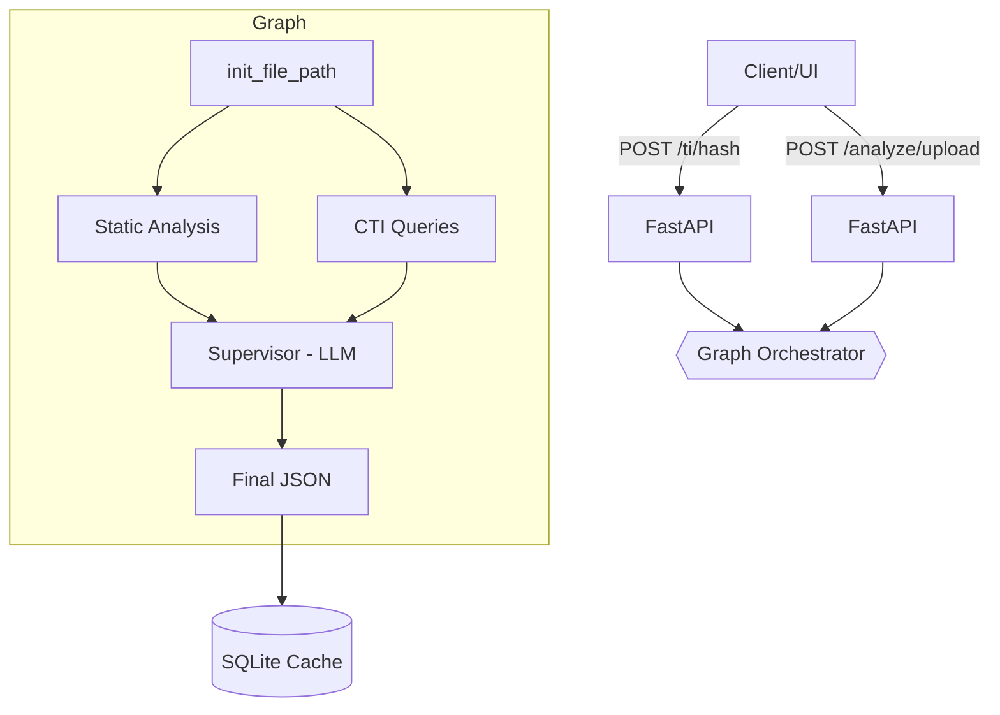

<div align="center">


# Mal-Dev AI

Autonomous, graph‑orchestrated malware triage with static analysis, YARA/CAPA, and Threat Intelligence — wrapped in a FastAPI backend and a lightweight Streamlit UI.

</div>

## Quick Install

**! Git, Unzip, Docker and Docker Compose MUST be installed in your system. !**

```bash
bash <(curl -fsSL https://raw.githubusercontent.com/devarajan-here/Mal-Dev-AI/main/run.sh)
```

## ⚠️ Disclaimers

### Malware Samples

* The files in `samples/` are **real malware samples** sourced from MalwareBazaar, provided **strictly for research and for testing this application**.
* All samples are ZIP-archived and **password-protected**.
  **Extraction password:** `infected`
* **Handle with extreme caution**: use an isolated lab environment (e.g., offline VM with snapshots). Never open or execute on personal or production systems.
* **Use at your own risk**. The maintainer is not liable for any damage or misuse.

### Model Support (Temporary Limitation)

* At the moment, **only Google Gemini models are supported and tested** (e.g., `gemini-2.0-flash`, `gemini-1.5-*`).
* Other providers/models (e.g., OpenAI, Anthropic) are **not yet integrated**.


## Why Mal-Dev AI
- Unified workflow: hashes, PE parsing, strings/IOCs, entropy hints, signatures, YARA, CAPA, and CTI — then a supervisor stitches it into a readable summary.
- Pragmatic: runs locally, ships with a simple UI, and supports Docker Compose.
- Extensible: modular tools under `src/tools/*` and a clear analysis graph in `src/agent/graph.py`.

## Features
- FastAPI endpoints for file-path and file-upload analysis
- Modular tools: hashing, header sniffing, PE parsing, imports/sections, strings + IOC extraction
- YARA and CAPA scanning (rules bundled/mounted)
- Threat Intelligence lookups: VirusTotal, MalwareBazaar, Hybrid Analysis, AlienVault OTX
- Results cache and browsing via SQLite
- Streamlit UI for quick triage and JSON export

## Architecture

The API orchestrates multiple analysis steps and CTI lookups in a small graph. The supervisor merges evidence and emits a structured JSON summary.



## Quickstart

Option A — Docker Compose (recommended):

```bash
docker compose build --no-cache
docker compose up -d

# UI → http://localhost:8501
# API → http://localhost:8000
```

Option B — Local Python:

```bash
python -m venv .venv
source .venv/bin/activate 
pip install -r requirements.txt

# Set env vars (see .env example below), then run the API:
uvicorn src.api.app:app --reload --host 0.0.0.0 --port 8000

# OpenAPI UI → http://localhost:8000/docs
# Health check → http://localhost:8000/healthz
```

Run the UI locally:

```bash
streamlit run ui/app.py
```

Tip: set `API_BASE` for the UI (defaults to `http://mal_ops_api:8000` in Docker):

```bash
export API_BASE="http://localhost:8000"
```

## Configuration (.env)

The app reads settings from environment variables (see `src/config.py`). Suggested `.env`:

```dotenv
# Logging and persistence
LOG_LEVEL=INFO
DB_PATH=./data/analyses.db

# LLM (LangChain Google GenAI)
GEMINI_API_KEY=your_gemini_api_key

# Threat Intelligence
VT_API_KEY=your_virustotal_api_key
ABUSE_API_KEY=your_abuse_malwarebazaar_api_key
OTX_API_KEY=your_alienvault_otx_api_key
HA_API_KEY=your_hybrid_analysis_api_key

# Rules (local paths when running without Docker)
YARA_RULES_DIR=./rules
CAPA_RULES_DIR=./rules/capa-rules
CAPA_SIGNATURES_DIR=./rules/capa-sigs

# Timeouts
DEFAULT_TIMEOUT=60
```

Notes:
- In Docker Compose, volumes mount `./rules` read-only into the API, and `DB_PATH` is set to `/data/analyses.db`.
- If you run locally, ensure `DB_PATH` points to a writable path.
- Without API keys, CTI providers will return error stubs but the API remains functional.

## API

Base URL (local): `http://localhost:8000`

- Health: `GET /healthz` → `{ "status": "ok" }`
- Analyze by upload: `POST /analyze/upload` with multipart form fields `file`, optional `hint`, `model`
- Threat Intel for hash: `POST /ti/hash` with JSON `{ "hash": "<sha256|md5>" }`
- Storage and cache:
  - `GET /analyses` — list with pagination and optional filters (`sha256`, `sha1`, `md5`, `date_from`, `date_to`)
  - `GET /analyses/{id}` — fetch full stored result by record id
  - `GET /analyses/sha256/{hash}` — fetch latest result for sha256
  - `DELETE /analyses/{id}` — delete record by id
  - `POST /analyses/purge?sha256=<hash>` — delete all for a sha256

Examples:

```bash
# Analyze via upload
curl -sS -X POST http://localhost:8000/analyze/upload \
  -F 'file=@samples/Lumma.exe' \
  -F 'hint=unpacked' \
  -F 'model=gemini-2.0-flash' | jq .

# CTI lookup by hash (sha256/md5)
curl -sS -X POST http://localhost:8000/ti/hash \
  -H 'Content-Type: application/json' \
  -d '{"hash":"e3b0c44298fc1c149afbf4c8996fb92427ae41e4649b934ca495991b7852b855"}' | jq .
```

## Project Structure

- `src/api/app.py`: FastAPI routes (analysis, CTI, storage)
- `src/agent/graph.py`: analysis graph orchestration
- `src/agent/nodes/*`: graph node implementations (init, static, cti, supervisor)
- `src/tools/*`: hashing, strings/IOCs, YARA, CAPA, helpers, CTI utilities
- `src/api/storage.py`: SQLite persistence, listing/filtering endpoints
- `ui/app.py`: Streamlit app for uploads, reports and JSON export
- `rules/`: YARA and CAPA rules; `capa-rules.zip` and signatures included
- `docs/`: MkDocs site (overview, API, architecture, reference)

## Development

Run tests:

```bash
pip install -r requirements.txt
pytest -q
```

Serve docs locally (optional):

```bash
pip install mkdocs-material mkdocstrings[python]
mkdocs serve
```

## Next Steps
- Implement Multiple LLM Providers
- Implement Dynamic Analysis using CAPE or DRAKVUF
- Static Analyze ELF files

## License

This project is licensed under the MIT License. See `LICENSE`.

## Acknowledgements
- YARA by VirusTotal community, CAPA by Mandiant/FLARE
- CTI providers: VirusTotal, MalwareBazaar (abuse.ch), AlienVault OTX, Hybrid Analysis
- Built with FastAPI, LangChain/Graph, and Streamlit
- [AskJOE Project](https://github.com/securityjoes/AskJOE)
