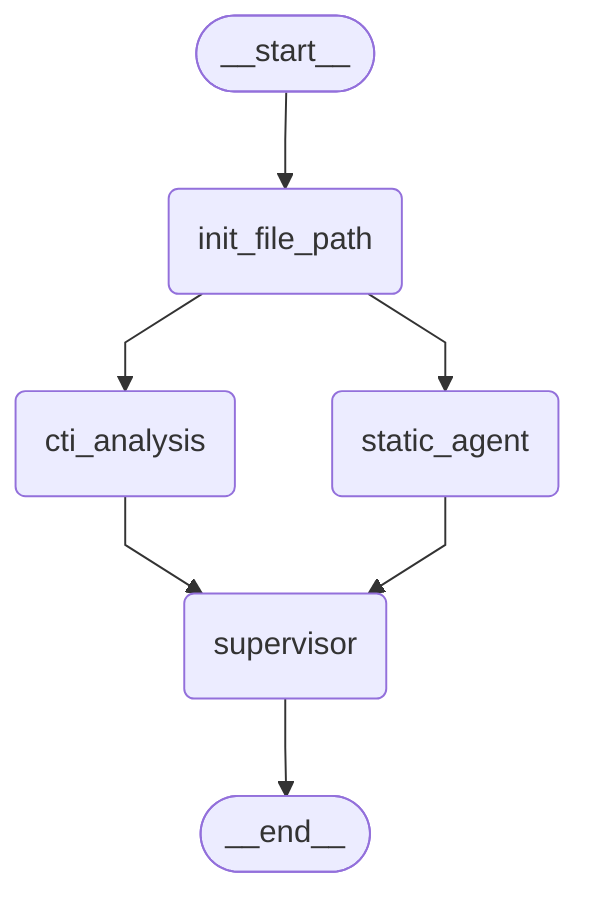

# Description

The flow uses a fan-out/fan-in pattern. `init_file_path` validates the input and seeds shared state, then triggers two parallel branches: `static_agent` (static triage—metadata, hashes, YARA/CAPA) and `cti_analysis` (threat-intel enrichment via hash/IOC lookups). A `supervisor` node merges results, deduplicates and reconciles evidence, assigns confidence, and outputs a single structured JSON summary.

## Langgraph Architecture

