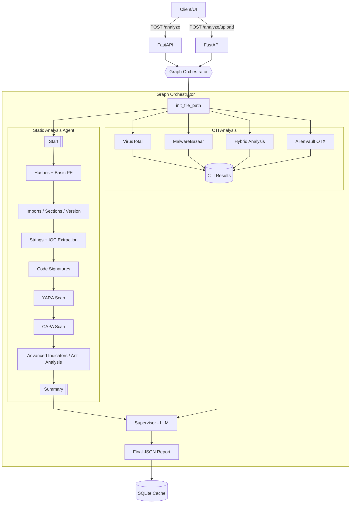

# Description

The system orchestrates multiple analysis steps and TI lookups in a graph. The final supervisor merges evidence and emits a structured JSON summary.

Key components:

- FastAPI app (`src/api/app.py`) exposes endpoints and invokes the graph.
- Storage (`src/api/storage.py`) persists and retrieves cached results by sha256.
- Graph (`src/agent/graph.py`) composes the pipeline nodes and supervisor.
- Tools (`src/tools/*.py`) provide hashing, string/IOC extraction, YARA and CAPA integration, etc.

## Overall Architecture

